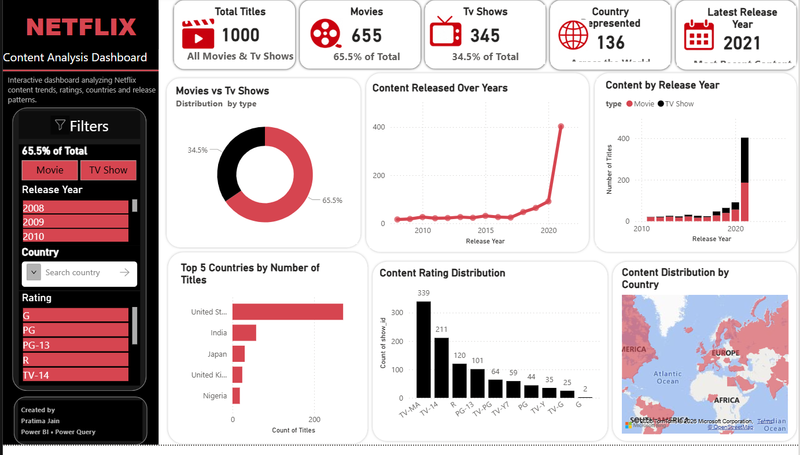

# 🎥 Netflix Content Analysis Dashboard

### *Interactive Business Intelligence Dashboard built using Power BI*

 

 

---

# 📖 Project Overview

Netflix has thousands of Movies and TV Shows available across different countries. Understanding content trends, ratings, release patterns, and geographical distribution can provide valuable business insights.

This interactive Power BI dashboard was developed to transform raw Netflix data into meaningful visual insights using professional dashboard design principles.

---

# 🎯 Project Objectives

✔ Analyze Movies vs TV Shows distribution

✔ Track content growth over the years

✔ Discover top contributing countries

✔ Understand content ratings

✔ Explore Netflix's global content library

✔ Build an interactive dashboard with slicers

---

# 📊 Dashboard Highlights

| KPI                      | Value |
| ------------------------ | ----- |
| 🎬 Total Titles          | 1000  |
| 🍿 Movies                | 655   |
| 📺 TV Shows              | 345   |
| 🌍 Countries Represented | 136   |
| 📅 Latest Release Year   | 2021  |

---

# 📈 Dashboard Features

✨ Interactive KPI Cards

✨ Dynamic Filters

✨ Power Query Data Cleaning

✨ DAX Measures

✨ Professional Netflix Theme

✨ Responsive Visual Layout

✨ Interactive Maps

✨ Business Insights

---

# 📷 Dashboard Visualizations

| Visualization           | Purpose                           |
| ----------------------- | --------------------------------- |
| 🍩 Donut Chart          | Movies vs TV Shows Distribution   |
| 📈 Line Chart           | Content Released Over Years       |
| 📊 Stacked Column Chart | Content by Release Year           |
| 🌍 Filled Map           | Country-wise Content Distribution |
| 📉 Bar Chart            | Top 5 Countries                   |
| 📊 Column Chart         | Content Rating Distribution       |

---

# 🎛 Interactive Filters

The dashboard supports dynamic filtering using:

* 🎬 Type
* 🌍 Country
* ⭐ Rating
* 📅 Release Year

All visuals update automatically based on selected filters.

---

# 💡 Key Insights

> 📌 Movies contribute **65.5%** of Netflix's content library.

> 📌 TV Shows account for **34.5%** of the total content.

> 📌 Netflix experienced significant content growth after **2018**.

> 📌 **TV-MA** is the most frequently assigned content rating.

> 📌 The **United States** contributes the highest number of titles.

> 📌 Netflix content spans **136 countries** worldwide.

---

# 🛠 Tech Stack

| Tool               | Purpose                 |
| ------------------ | ----------------------- |
| Microsoft Power BI | Dashboard Development   |
| Power Query        | Data Cleaning           |
| DAX                | Measures & Calculations |
| Microsoft Excel    | Dataset Preparation     |

---

📚 Dataset Information (Click to Expand)

The dataset contains:

* Show ID
* Title
* Type
* Director
* Cast
* Country
* Date Added
* Release Year
* Rating
* Duration
* Genre

---

🚀 Future Improvements (Click to Expand)

* Director Analysis Dashboard
* Genre Analysis
* Actor Analysis
* Monthly Trend Analysis
* Advanced DAX KPIs
* Drill-through Pages
* Tooltip Reports

---

### 🚀 From Raw Data to Actionable Insights

*"Data is more than numbers—it's the foundation for better decisions."*

Thank you for exploring this project!

⭐ Your feedback and suggestions are always welcome.

